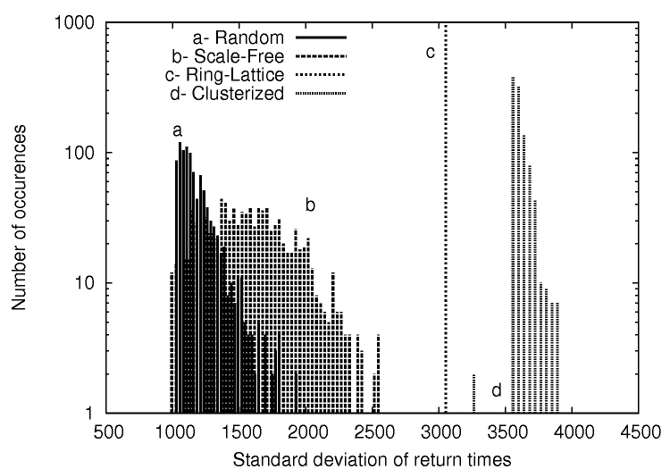

# Second order centrality (NetworkX implementation)

The second order centrality (SOC) is a [centrality](https://en.wikipedia.org/wiki/Centrality) or 'importance' metric for nodes in a graph.
The SOC of a given node is the standard deviation of the return times to that node of a perpetual random walk on the graph.

Despite the general use of SOC for computation in a distributed setup, this implementation is for single core computation, where the graph to analyze is passed to the function as an argument.

This code implements the analytical version of the algorithm, i.e., there is no simulation of a random walk process involved. The random walk is here unbiased (corresponding to eq 6 of the paper):

Anne-Marie Kermarrec, Erwan Le Merrer, Bruno Sericola, Gilles Trédan,
"Second order centrality: Distributed assessment of nodes criticity in
complex networks", Elsevier Computer Communications 34(5):619-628, 2011. [Available here.](https://www.sciencedirect.com/science/article/pii/S0140366410002689)

## Requirements

This implementation is meant to be used with [NetworkX](https://networkx.github.io/).

Python

NumPy

## Example use

Most central node of a star graph:

```
>>> G = nx.star_graph(10)
>>> soc = second_order_centrality(G)
>>> print(sorted(soc.items(), key=lambda x:x[1])[0][0]) # pick first id
0  # most central node

```

Various topologies exhibit various SOC signatures; from paper implementation: 



## More information

Written and maintained by Erwan Le Merrer (erwan.lemerrer@technicolor.com)
